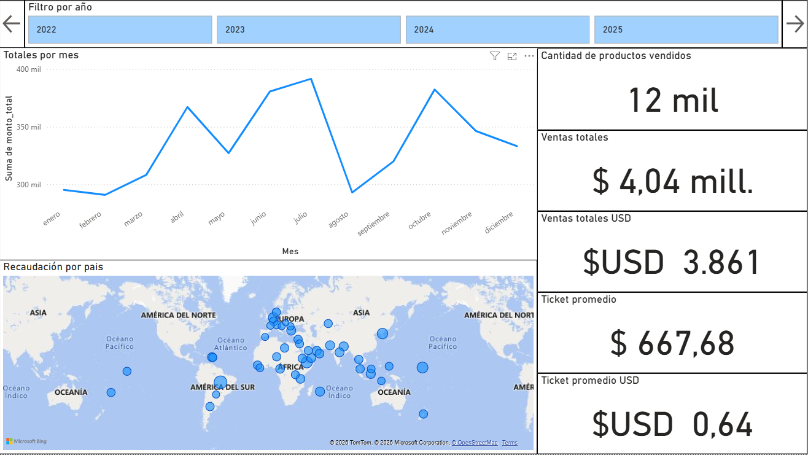
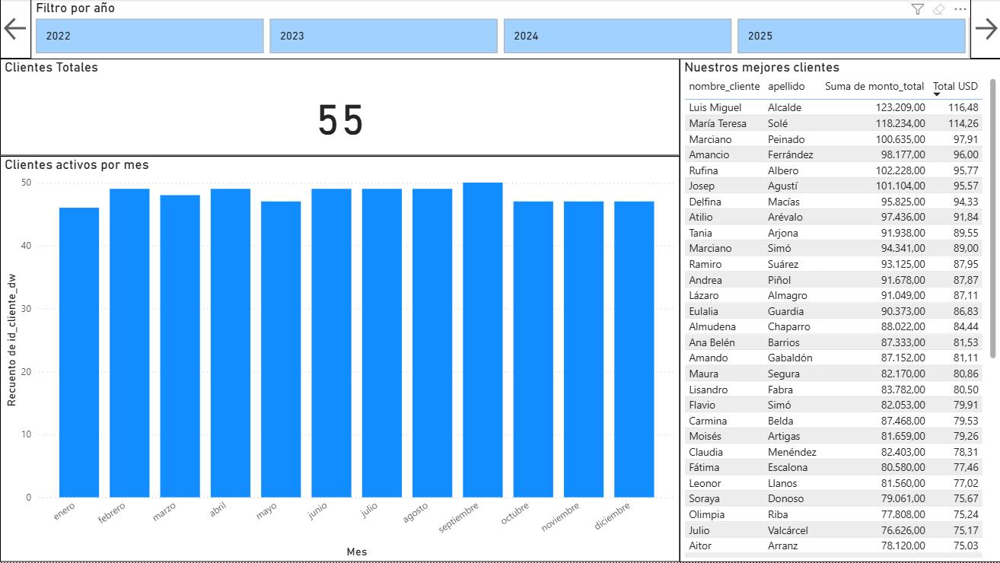
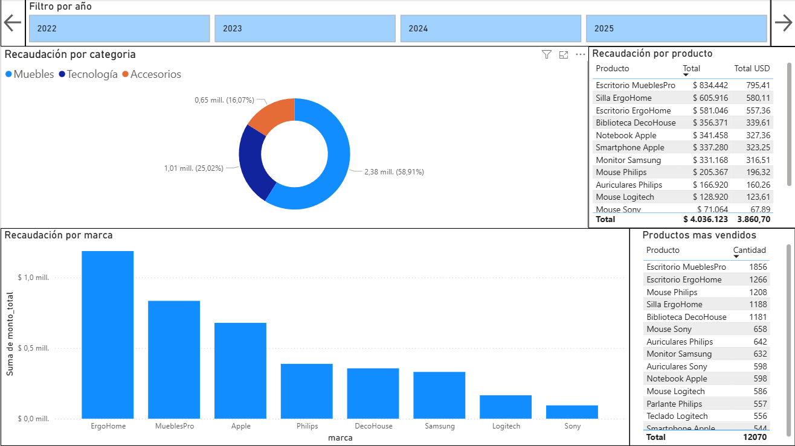
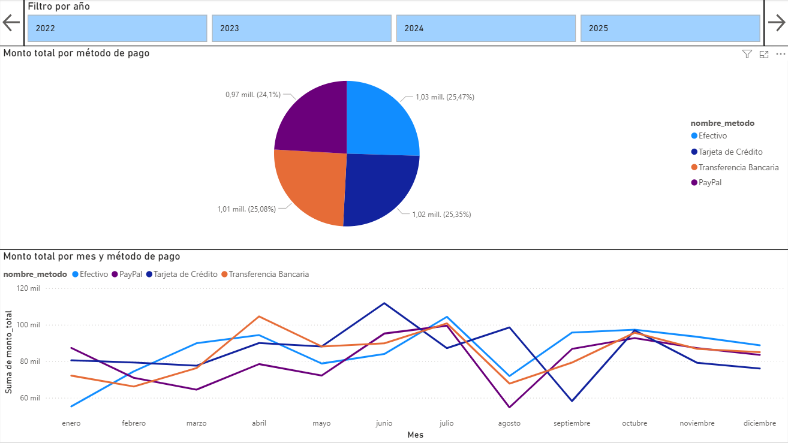
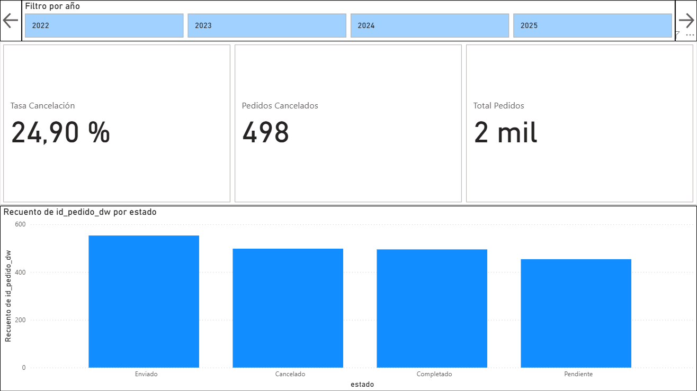

# 📊 Proyecto Data Warehouse con SCD Tipo 2 + Power BI

## 📌 Descripción
Este proyecto consiste en el diseño e implementación de un sistema completo que parte de un modelo OLTP, se transforma en un Data Warehouse con modelo estrella, incorpora una Dimensión Lentamente Cambiante (SCD Tipo 2) y finaliza con un dashboard interactivo en Power BI.

El objetivo es simular un entorno real de BI, contemplando procesos de modelado, carga, versionado histórico y análisis de datos.

---
## 💡 Qué se destaca en este proyecto

- Diseño completo de OLTP y Data Warehouse
- Implementación de Slowly Changing Dimension Tipo 2
- Creación de modelo estrella
- Scripts de carga y transformación
- Dashboard analítico en Power BI

## 🛠️ Tecnologías utilizadas
- SQL Server
- T-SQL
- Power BI
- Modelado dimensional
- Data Warehouse
- Slowly Changing Dimensions (Tipo 2)

---

## 🏗️ Arquitectura del proyecto
1. Creación de base OLTP  
2. Proceso de transformación a Data Warehouse  
3. Implementación de dimensiones y tabla de hechos  
4. Implementación de SCD Tipo 2  
5. Construcción de dashboard en Power BI  

---

## 🗃️ Estructura del repositorio
- `01_oltp/` → creación y carga del sistema transaccional  
- `02_dwh/` → modelo estrella, dimensiones, hechos y SCD  
- `03_queries_analisis/` → consultas de explotación  
- `04_power_bi/` → dashboard  
- `05_documentacion/` → diagramas y documentación  

---

## 📈 Dashboard

---

## 🚀 Cómo ejecutar el proyecto
1. Ejecutar los scripts de `01_oltp` en orden (ejecutar "poblado_OLTP" una sola vez)
2. Ejecutar los scripts de `02_dwh` en orden
3. Abrir el archivo Power BI
4. Actualizar conexiones

---

## 👤 Autor
Pablo Foix  
[GitHub](https://github.com/pablofoix)
